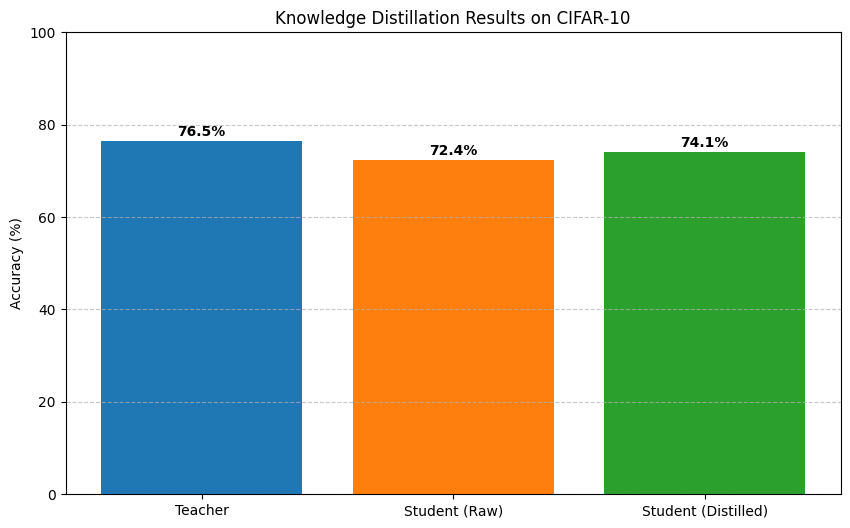

# Knowledge Distillation Toolkit

A lightweight, device-agnostic toolkit for knowledge distillation that runs efficiently on Apple Silicon (M1/M2) and other hardware.

  
*Example of distillation performance improvement on CIFAR-10*

---

## Features

- 🍏 Optimized for Apple Silicon (MPS acceleration)
- 📦 Easy-to-use API for knowledge distillation
- 🔄 Supports both teacher training and student distillation
- 📊 Automatic accuracy comparison between teacher and student
- 💾 Model saving and visualization of results

---

## How It Works

Knowledge distillation transfers knowledge from a large, accurate "teacher" model to a smaller "student" model:

### Process:
1. **Teacher Training:**  
   A complex model is trained to high accuracy.

2. **Knowledge Transfer:**  
   The student learns from both:
   - Hard labels (true class labels)
   - Soft labels (teacher's probabilistic predictions)

3. **Distillation Outcome:**  
   The student model achieves:
   - Similar accuracy as the teacher
   - Smaller size and faster inference
   - Better performance than training alone

---

## Installation

Create a conda environment (recommended):

```bash
conda create -n distiller python=3.9
conda activate distiller
```

Install dependencies:

```bash
pip install torch torchvision torchaudio --extra-index-url https://download.pytorch.org/whl/cpu
pip install tqdm matplotlib scikit-learn numpy
```

> **Note:** If using Apple Silicon (M1/M2), PyTorch will automatically use MPS backend if available.

---

## Usage

### 1. Run the Full Demo

```bash
python demo.py
```

This will:
- Train a teacher model on CIFAR-10
- Train a student model without distillation (baseline)
- Perform knowledge distillation
- Save the distilled student model
- Generate accuracy comparison plot

### 2. Test the Trained Model

```bash
python test_model.py
```

This will:
- Load the distilled student model
- Evaluate accuracy on test set
- Visualize predictions on sample images

---

## File Structure

```text
.
├── data
│   ├── cifar-10-batches-py
│   │   ├── batches.meta
│   │   ├── data_batch_1
│   │   ├── data_batch_2
│   │   ├── data_batch_3
│   │   ├── data_batch_4
│   │   ├── data_batch_5
│   │   ├── readme.html
│   │   └── test_batch
│   └── cifar-10-python.tar.gz
├── demo.py                      # Main training and distillation script
├── distillation_results.png    # Accuracy comparison plot
├── distillation_toolkit.py     # Toolkit logic
├── distilled_student.pth       # Saved student model (post-distillation)
├── Miniconda3-latest-MacOSX-x86_64.sh
├── model_predictions.png       # Sample predictions
├── optimized_demo.py
├── requirements.txt
└── test_model.py               # Model evaluation and visualization
```

---

## Customization

### 🔧 Use Your Own Models

Edit the model architectures in `demo.py`:

```python
# Teacher model
class CIFARTeacher(nn.Module):
    def __init__(self):
        # Your custom architecture here

# Student model
class CIFARStudent(nn.Module):
    def __init__(self):
        # Your custom architecture here
```

---

### 🧪 Use Different Hyperparameters

Modify parameters in the `distill()` call:

```python
trainer.distill(
    train_loader, 
    epochs=10,               # Number of training epochs
    temperature=3.0,         # Distillation temperature
    alpha=0.7,               # Weight for CE loss vs KL loss
    student_only=False       # Set to True for baseline training
)
```

---

### 📂 Use Different Datasets

Change the dataset loader in `demo.py`:

```python
# For CIFAR-100
train_set = datasets.CIFAR100('./data', train=True, download=True, transform=transform)

# For FashionMNIST
train_set = datasets.FashionMNIST('./data', train=True, download=True, transform=transform)
```

---

## Expected Results

After running `demo.py`, the output will include:

- Teacher model training log
- Student baseline training (without distillation)
- Knowledge distillation process
- Accuracy results

```text
==================================================
👨🏫 Teacher Accuracy: 81.32%
👨🎓 Student Accuracy: 76.81%
==================================================
```

Visual outputs:
- `distillation_results.png` — comparison plot
- `model_predictions.png` — predicted image samples

---

## Troubleshooting

### Common Issues

- **NumPy compatibility errors:**

  ```bash
  pip uninstall -y numpy
  pip install "numpy<2"
  ```

- **Slow first epoch:**  
  The first epoch precomputes teacher outputs. It gets faster after that.

- **Out-of-memory (OOM) on M1/M2:**
  - Reduce batch size
  - Insert `torch.mps.empty_cache()` in the training loop

---

## Performance Tips

- Use batch sizes between `64` and `128` for optimal MPS utilization.
- Set `pin_memory=True` in `DataLoader`.
- Monitor memory usage on MPS:

```python
if torch.backends.mps.is_available():
    print(f"MPS Memory: {torch.mps.current_allocated_memory()/1e6:.1f} MB")
```

---

## License

This project is licensed under the MIT License. See the [LICENSE](LICENSE) file for details.

---

**Happy distilling!** 🧠➡️🎓
