# Zynthe Universal Distillation Toolkit — Foundation Plan

Build a production-ready, modality-agnostic distillation pipeline with a unified CLI, extensible evaluation, and robust model persistence.

---

## User Review Required

> [!IMPORTANT]
> **Phase ordering**: Phases 1–3 are foundational and should be done first. Phases 4–6 can be parallelized. Please confirm the priority order below or adjust.

> [!WARNING]
> **Heavy dependencies**: Phases 5–6 require `torch`, `transformers`, `torchvision`, `datasets` to be installed. On the Latitude 7490 (CPU-only), full integration tests will be slow (~10–20 min for a 3-epoch BERT→DistilBERT run). We can stub/mock for unit tests and defer full runs to Colab/Kaggle.

## Resolved Questions

1. ✅ **Vision datasets**: Support **all** image formats — CIFAR-10, CIFAR-100, ImageNet-subset, ImageFolder (custom dirs), STL-10, etc.
2. ✅ **Export formats**: Wire **all** formats into CLI — ONNX, TorchScript, **SafeTensors**, **GGUF**, **BitNet**
3. ✅ **Kaggle/Colab**: Self-contained notebooks that `git clone` the repo
4. ✅ **Multimodal**: Include CLIP foundation in Phase 5

## Production Readiness Milestones

| Milestone | Phase | What's Releasable |
|-----------|-------|-------------------|
| 🟡 **Alpha** | Phase 3 done | Core pipeline works E2E for NLP, models save/load correctly |
| 🟢 **GitHub MVP** | Phase 4 done | Clean CLI, installable, documented — ready for `v0.1.0` release |
| 🔵 **Full Release** | Phase 6 done | Vision + multimodal, comprehensive tests — ready for `v1.0.0` |

> [!IMPORTANT]
> After completing each phase, I will re-evaluate and update the plan for subsequent phases based on what we learned.

---

## Phase 1 — Code Health & Static Analysis Fixes

Clean up all lint and type errors so CI/CD can gate on them.

> [!NOTE]
> These are non-breaking, mechanical fixes. No behavioral changes.

---

### Lint & Syntax (flake8)

#### [MODIFY] [data_validator.py](file:///home/limitless/zynthe/core/utils/data_validator.py)
- Remove empty f-strings (F541)

#### [MODIFY] [hf_dataset_loader.py](file:///home/limitless/zynthe/core/utils/hf_dataset_loader.py)
- Remove empty f-strings (F541)

#### [MODIFY] [resource_probe.py](file:///home/limitless/zynthe/core/preflight/resource_probe.py)
- Replace bare `except:` with `except Exception:` (E722)
- Remove empty f-strings (F541)

#### [MODIFY] [advanced.py](file:///home/limitless/zynthe/core/preprocessing/advanced.py)
- Rename ambiguous variable `l` → `length` (E741)

#### [MODIFY] [trainer.py](file:///home/limitless/zynthe/training/trainer.py)
- Remove duplicate `plot_metrics` import (F811 — lines 4, 13, and 1851/1871)
- Remove empty f-strings (F541)

#### [MODIFY] [test_adapters.py](file:///home/limitless/zynthe/tests/test_adapters.py)
- Rename ambiguous `l` → `label` (E741)

---

### Type Checking (mypy)

#### [MODIFY] [main.py](file:///home/limitless/zynthe/app/main.py)
- Add `# type: ignore[assignment]` to `rprint = print` fallback (line 32)

#### [MODIFY] [__init__.py](file:///home/limitless/zynthe/core/distillers/__init__.py)
- Add `# type: ignore[assignment]` to `DistillationToolkit = None` fallback

#### [MODIFY] [base_distiller.py](file:///home/limitless/zynthe/core/distillers/base_distiller.py)
- Fix bare `except:` in `__del__` (line 676) → `except Exception:`

---

## Phase 2 — Visualization & Evaluation Refactor

**Problem**: The current visualizer is tightly coupled to classification metrics. It doesn't support vision metrics (FID, SSIM), LM metrics (perplexity, BLEU), or multimodal metrics (retrieval recall@k). The `Evaluator` and `Trainer.evaluate()` have duplicated diagnostics/runtime code.

**Goal**: Create a modality-agnostic evaluation framework where metrics, diagnostics, and visualization are pluggable.

---

### Evaluation Module

#### [MODIFY] [evaluator.py](file:///home/limitless/zynthe/evaluation/evaluator.py)
- Add a `modality` parameter (`"text"`, `"vision"`, `"multimodal"`) to `__init__` that controls which metric computation path runs
- For `modality="vision"`: skip text-specific decoding, add top-k accuracy, per-class IoU placeholders
- For `modality="text"` (default): preserve current behavior
- Extract `_build_diagnostics` into a standalone function (dedup with `Trainer._build_eval_diagnostics`)
- Add a `generate_report()` method that returns a structured `EvaluationReport` dataclass

#### [NEW] [evaluation_report.py](file:///home/limitless/zynthe/evaluation/evaluation_report.py)
- Define `EvaluationReport` dataclass:
  ```python
  @dataclass
  class EvaluationReport:
      loss: Optional[float]
      metrics: Dict[str, Any]
      diagnostics: Dict[str, Any]
      runtime: Optional[Dict[str, Any]]
      calibration: Optional[Dict[str, Any]]
      explainability: Optional[Dict[str, Any]]
      modality: str
      timestamp: str
  ```
- Add `save_json()` and `save_markdown()` methods
- This replaces the ad-hoc dicts currently returned by `Trainer.evaluate()`

---

### Visualization Module

#### [MODIFY] [visualizer.py](file:///home/limitless/zynthe/evaluation/visualizer.py)
- Add `plot_evaluation_dashboard()` — a single entry point that auto-selects plots based on available data:
  - If `calibration` data exists → render reliability diagram
  - If `runtime` data exists → render latency profile
  - If `metrics` history exists → render metric grid
  - If `train_losses` / `val_losses` exist → render training curves
- Add `plot_distillation_gap()` — shows teacher vs student metric delta over epochs (currently only loss is compared; extend to accuracy, F1, perplexity)
- Add `plot_extended_metrics()` — visualize KL divergence, prediction agreement, DEI/CAS trends from `metrics_extended.py`

#### [MODIFY] [trainer.py](file:///home/limitless/zynthe/training/trainer.py) (visualization calls)
- Replace the 7+ scattered `try/except` plot calls at end of `fit()` (lines 1831–1906) with a single call to `plot_evaluation_dashboard()`
- Wire the new `EvaluationReport` into the evaluate() return path instead of raw tuple `(avg_loss, metrics, extended, details)`

---

## Phase 3 — Model Save/Load Pipeline Integration

**Problem**: `ModelSaver` and `ModelLoader` exist but aren't wired into the `Trainer.fit()` lifecycle. Currently, `fit()` manually calls `save_pretrained()` (lines 1817–1827). Checkpointing is ad-hoc.

**Goal**: Standardize save/load/export into the pipeline so every run produces consistent artifacts.

---

### Model Persistence

#### [MODIFY] [model_saver.py](file:///home/limitless/zynthe/core/models/model_saver.py)
- Add `save_training_run()` method that bundles:
  - Student model + tokenizer (HF format)
  - Training config (resolved YAML)
  - Metrics history (JSON)
  - Best checkpoint (`.pt` with optimizer + scheduler state)
  - Evaluation report (from Phase 2)
- Add `export_for_deployment()` supporting **all formats**:
  - **ONNX** — cross-platform inference (ONNX Runtime)
  - **TorchScript** — PyTorch-native deployment
  - **SafeTensors** — fast, safe HF-native format (`safetensors` lib)
  - **GGUF** — llama.cpp compatible quantized format (for LLM students)
  - **BitNet** — 1-bit weight format for ultra-compact deployment
- Each format gets a dedicated export method with validation
- CLI flag: `zyn export --format onnx,safetensors,gguf`

#### [MODIFY] [trainer.py](file:///home/limitless/zynthe/training/trainer.py) (save integration)
- Replace manual `save_pretrained()` calls (lines 1817–1827) with `ModelSaver.save_training_run()`
- Add per-epoch checkpointing via `ModelSaver` (controlled by config: `train.save_checkpoints: true`)
- Wire checkpoint resume via `--load-checkpoint-path` CLI flag (already parsed in `main.py` but not fully integrated)

#### [MODIFY] [model_loader.py](file:///home/limitless/zynthe/core/models/model_loader.py)
- Add `resume_from_checkpoint()` classmethod that restores:
  - Model weights
  - Optimizer state
  - Scheduler state
  - Epoch counter
  - Best validation loss
- Validate checkpoint device compatibility (CUDA checkpoint → CPU fallback)

---

## Phase 4 — CLI Unification

**Problem**: `app/main.py` is 1595 lines with everything mixed together. The CLI uses both `argparse` and `typer`, causing confusion. Some commands exist as `typer` subcommands but aren't discoverable.

**Goal**: Clean CLI with `typer` subcommands: `distill`, `evaluate`, `export`, `compare`, `info`.

---

### CLI Architecture

#### [MODIFY] [main.py](file:///home/limitless/zynthe/app/main.py)
- Remove duplicate `argparse` parser (lines 66–115) — consolidate into `typer` only
- Restructure into clear subcommands:

| Command | Description | Key flags |
|---------|-------------|-----------|
| `zyn distill` | Run distillation pipeline | `--config`, `--override`, `--resume` |
| `zyn evaluate` | Standalone evaluation | `--model-dir`, `--data`, `--task-type` |
| `zyn export` | Export model (ONNX/TorchScript) | `--model-dir`, `--format`, `--output` |
| `zyn compare` | Teacher vs student comparison | `--teacher-dir`, `--student-dir` |
| `zyn info` | Print config/device/env info | `--config` |

- Each subcommand should be a separate function (~50–100 lines max)
- Move shared logic (config loading, device detection, model loading) into helpers

---

## Phase 5 — Vision & Multimodal Pipeline Support

**Problem**: The pipeline is NLP-first. Vision and multimodal models work through adapters but the data loading, evaluation, and CLI paths don't fully support them.

**Goal**: Make `zyn distill --config configs/vision.yaml` work end-to-end for ViT→DeiT distillation.

---

### Vision Pipeline

#### [MODIFY] [image_dataloaders.py](file:///home/limitless/zynthe/data/image_dataloaders.py)
- Generalize into a universal image dataloader factory supporting:
  - **CIFAR-10** / **CIFAR-100** — torchvision built-ins
  - **STL-10** — torchvision built-in
  - **ImageNet-subset** — HF `datasets` or torchvision ImageFolder
  - **ImageFolder** — arbitrary `train/` `val/` directory structure
  - **Custom HF datasets** — load via `datasets.load_dataset()`
- Config-driven: `data.image_dataset: cifar10 | cifar100 | stl10 | imagenet | image_folder | hf:<dataset_id>`
- Proper train/val split with configurable ratios
- Automatic image preprocessing via adapter (resize, normalize, augment)

#### [NEW] [configs/vision_cifar10.yaml](file:///home/limitless/zynthe/configs/vision_cifar10.yaml)
- Example config for ViT-base → ViT-small distillation on CIFAR-10
- Configured for CPU/T4 with appropriate batch sizes

#### [MODIFY] [evaluator.py](file:///home/limitless/zynthe/evaluation/evaluator.py)
- When `modality="vision"`, skip `tokenizer.batch_decode()` calls
- Accept `pixel_values` as primary input key instead of `input_ids`
- Compute vision-specific metrics: top-1, top-5 accuracy

#### [MODIFY] [trainer.py](file:///home/limitless/zynthe/training/trainer.py)
- In `train_epoch()` and `evaluate()`, detect modality from pipeline/config and route batch construction accordingly
- The `_filter_batch_for_model()` method already handles this via adapter introspection, but the hardcoded `batch.get('labels')` and text-specific paths need guards

---

### Multimodal Pipeline (Foundation)

#### [NEW] [configs/multimodal_clip.yaml](file:///home/limitless/zynthe/configs/multimodal_clip.yaml)
- Placeholder config for CLIP teacher → smaller CLIP student
- Documents required data format (image-text pairs)

> [!NOTE]
> Full multimodal distillation is a larger effort. Phase 5 focuses on making the infrastructure ready (adapter routing, config schema) without requiring a complete CLIP distillation implementation.

---

## Phase 6 — Testing & Validation

**Problem**: Tests require heavy deps (`torch`, `transformers`). No integration test runs end-to-end. No Colab/Kaggle playbook.

**Goal**: CPU-safe unit tests that run on the Latitude 7490, plus Colab notebooks for GPU validation.

---

### Unit Tests (CPU-safe)

#### [MODIFY] [conftest.py](file:///home/limitless/zynthe/tests/conftest.py)
- Add `tiny_models` fixture that creates minimal BERT/DistilBERT configs (2 layers, 32 hidden) for fast CPU testing
- Add `mock_dataloader` fixture that generates synthetic batches

#### [NEW] [test_evaluation_report.py](file:///home/limitless/zynthe/tests/test_evaluation_report.py)
- Test `EvaluationReport` serialization, markdown generation
- Test `plot_evaluation_dashboard()` doesn't crash with empty/partial data

#### [NEW] [test_model_saver.py](file:///home/limitless/zynthe/tests/test_model_saver.py)
- Test `save_training_run()` creates expected directory structure
- Test `export_for_deployment()` with mock models

#### [MODIFY] [test_pipeline_refactor.py](file:///home/limitless/zynthe/tests/test_pipeline_refactor.py)
- Remove unused `distiller` variable (F841)
- Add vision pipeline test using CIFAR-10 wrapper with tiny ViT

---

### Integration Tests (Colab/Kaggle)

#### [NEW] [notebooks/test_distillation_colab.ipynb](file:///home/limitless/zynthe/notebooks/test_distillation_colab.ipynb)
- Self-contained notebook that:
  1. `pip install`s from `requirements.txt`
  2. Downloads SST-2 data via `hf_dataset_loader`
  3. Runs 1-epoch BERT→DistilBERT distillation
  4. Validates output artifacts exist
  5. Generates evaluation report
- Designed for Colab T4 (free tier): ~5 min runtime

#### [NEW] [notebooks/test_vision_colab.ipynb](file:///home/limitless/zynthe/notebooks/test_vision_colab.ipynb)
- ViT distillation on CIFAR-10 with evaluation dashboard

---

## Verification Plan

### Automated Tests
```bash
# Phase 1: Lint passes
flake8 . --select=E7,E9,F --exclude=.git,__pycache__,*.backup
mypy app/main.py core/distillers/__init__.py --ignore-missing-imports

# Phase 2-3: Unit tests pass on CPU
python -m pytest tests/ -v --timeout=120

# Phase 4: CLI smoke test
python app/main.py info --config configs/default.yaml
```

### Manual Verification
- **Latitude 7490 (local)**: Run unit tests, lint, CLI smoke tests
- **Colab T4**: Run integration notebooks for NLP + Vision pipelines
- **Kaggle P100**: Run the same notebooks (no MCP — manual upload or git clone)

---

## Execution Order

```mermaid
gantt
    title Zynthe Foundation Build
    dateFormat  X
    axisFormat %s

    section Phase 1
    Code Health Fixes           :p1, 0, 2

    section Phase 2
    Evaluation Report Dataclass :p2a, 2, 3
    Visualizer Dashboard        :p2b, 3, 5
    Trainer Integration         :p2c, 5, 6

    section Phase 3
    ModelSaver Enhancement      :p3a, 6, 8
    Checkpoint Resume           :p3b, 8, 9

    section Phase 4
    CLI Refactor                :p4, 6, 9

    section Phase 5
    Vision Dataloaders          :p5a, 9, 11
    Vision Config + Eval        :p5b, 11, 12

    section Phase 6
    Unit Tests                  :p6a, 9, 11
    Colab Notebooks             :p6b, 12, 13
```



> [!TIP]
> Phases 4 and 6 (CLI + Tests) can run in parallel with Phase 3. Phase 5 depends on Phase 2 (modality-aware evaluation).
